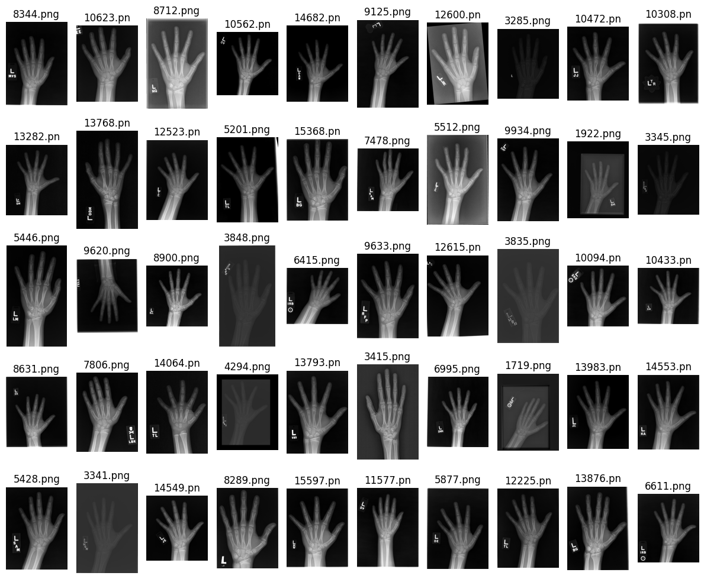
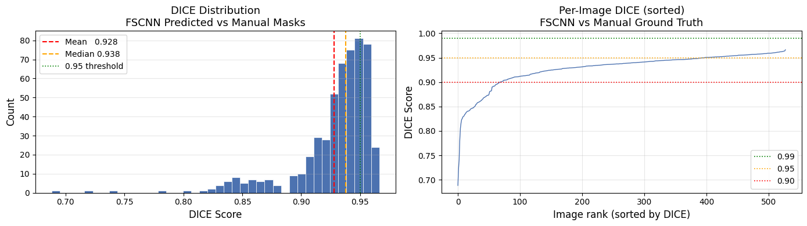
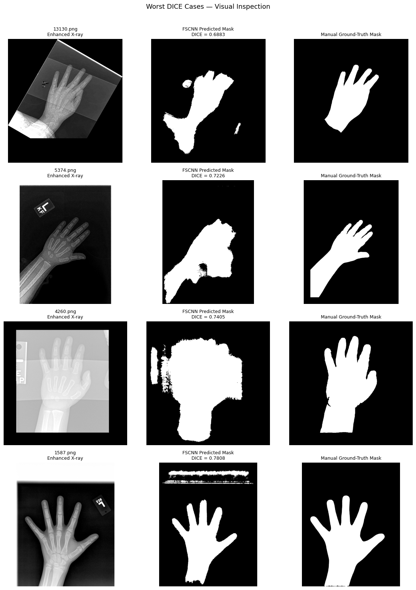

# Bone-age-XRay-preprocessing-DL-comparison
This project studies how image preprocessing and artifact removal affect deep learning performance on pediatric bone age estimation.   I compare multiple CNN architectures across three dataset variants: original images, enhanced images (normalization + CLAHE), and delabeled images with non-anatomical artifacts removed.

# Bone Age Assessment — Preprocessing & DL Benchmarking

A study on how **image preprocessing quality affects deep learning model performance** on pediatric bone age prediction from hand X-rays (RSNA 2017 dataset).

The project is structured as a 3 × 5 experiment matrix:

|  | ResNet-50 | EfficientNet-B3 | EfficientNet-V2 | ViT-B/16 | ConvNeXt-V2 |
|---|---|---|---|---|---|
| **Raw** | — | — | — | — | — |
| **Enhanced** (CLAHE) | — | — | — | — | — |
| **Cleaned** (Delabeled) | — | — | — | — | — |

> **Status:** Phase 1 (preprocessing pipeline) ✅ complete.  
> Phase 2 (model training & benchmarking) 🔄 in progress.  
> Experiment tracking on [Weights & Biases](https://wandb.ai/) — project `rsna-bone-age-matrix`.

***

## Why This Project

Hand X-rays in the RSNA dataset have significant variation in exposure, positioning, and artifact density — ruler labels, text overlays, and detector marks appear in random positions and sizes.

The core question is:

> *Does removing these artifacts and standardising contrast improve downstream model accuracy, and by how much?*

Most published bone age models train directly on raw X-rays. This project isolates the preprocessing effect by holding model architecture, training code, and evaluation split constant across all three data variants.

***

## Dataset

12,611 labelled pediatric hand X-rays. Labels: bone age in months (range 1–228). 
Data hosted entirely on Kaggle — see [`data/README.md`](data/README.md).

| Stage | Source | Size |
|---|---|---|
| Raw | [kmader/rsna-bone-age](https://www.kaggle.com/datasets/kmader/rsna-bone-age) | 12,611 images |
| Enhanced | [ak7180979/preprocessed-rsna-boneage-xrays](https://www.kaggle.com/datasets/ak7180979/preprocessed-rsna-boneage-xrays) | 12,611 images |
| Cleaned (Delabeled) | [ak7180979/delabeled-rsna-boneage-xrays](https://www.kaggle.com/datasets/ak7180979/delabeled-rsna-boneage-xrays) | 12,611 images |

***

## Preprocessing Pipeline (Phase 1)

```
Raw X-ray (RSNA)
      │
      ▼
┌─────────────────────────────────┐
│  Step 1 – Enhancement           │
│  • Percentile normalisation     │  clips to [p1, p99], rescales to [0,255]
│  • CLAHE (dull images only)     │  clip_limit=2.0, tile=(8×8)
└───────────────┬─────────────────┘
                │
                ▼
┌─────────────────────────────────┐
│  Step 2 – FSCNN Training        │
│  • FastSurferCNN (U-Net)        │  trained on enhanced + manual masks
│  • Loss: Dice + Cross-Entropy   │  DICE score achieved: ___ (reported)
└───────────────┬─────────────────┘
                │
                ▼
┌─────────────────────────────────┐
│  Step 3 – Artifact Removal      │
│  • FSCNN predicts hand mask     │  512×512 → upsampled to original res
│  • Background zeroed out        │  strategy: blackout or TELEA inpaint
└───────────────┬─────────────────┘
                │
      Enhanced & Cleaned variants
      ready for model training
```

### Key parameters

| Parameter | Value |
|---|---|
| Dullness threshold | mean pixel < 50 |
| CLAHE clip limit | 2.0 |
| CLAHE tile grid | 8 × 8 |
| FSCNN input size | 512 × 512 |
| Mask threshold | 0.50 |
| Removal strategy | Blackout |

***

## Repository Structure

```
bone-age-assessment/
├── README.md
├── requirements.txt
├── .gitignore
│
├── configs/
│   └── preprocessing.yaml       ← All tuneable pipeline parameters
│
├── src/
│   ├── dataset_builder.py       ← Load & standardise RSNA CSV
│   ├── preprocessing.py         ← Normalisation + CLAHE (Step 1)
│   ├── fscnn_module.py          ← FastSurferCNN Lightning module (Step 2)
│   ├── artifact_removal.py      ← FSCNN inference + background removal (Step 3)
|   ├── dice_eval.py             ← DICE Score Evaluation — FSCNN Predicted Masks vs Manual Ground-Truth Masks  
│   └── visualize.py             ← Diagnostic plots
│
├── notebooks/
│   └── bone-age-experimentation-notebook.ipynb   ← Full preprocessing walkthrough
│
├── data/
│   └── README.md                ← Dataset access instructions (no images stored here)
│
├── docs/
│   └── methodology.md           ← Research question, design, and evaluation plan
│
└── results/
    └── figures/                 ← Saved comparison plots
```

***

## Quickstart

### 1. Clone and install

```bash
git clone https://github.com/ak7180979/bone-age-assessment.git
cd bone-age-assessment
pip install -r requirements.txt
```

### 2. Clone FSCNN dependency

```bash
git clone https://github.com/aimi-bonn/hand-segmentation.git
# The FSCNN lib directory is added to sys.path in fscnn_module.py
```

### 3. Configure paths

Edit `configs/preprocessing.yaml` to point to your local Kaggle data directories,
or use the notebook directly on Kaggle where all datasets are pre-mounted.

### 4. Run preprocessing

```python
from src.dataset_builder  import load_rsna_dataframe
from src.preprocessing    import build_or_load_enhanced_df
from src.artifact_removal import build_or_load_cleaned_df

df = load_rsna_dataframe()
df = build_or_load_enhanced_df(df)
df = build_or_load_cleaned_df(df, model_module=...)
```

Or run the full notebook:  
[notebooks\bone-age-experimentation-notebook.ipynb]

***
## Results (Phase 1 — Pre-processing)

- 
   - A sample pull shows --> Variation in contrasts and brightness, hand positions are not uniform, and labels and artifacts are in random positions. Sizes also varies.

- 
   - Improved image quality especially for darker X-Rays. 
   - However backgrounds can get over exposed where the difference between the hand and the background is less prominant.
   - As next steps, a change in hyperparameters (clip limits) may be explored along with anditional pre-processing to focus on the region-of-interest and improve normalization in X-Rays with narrow intensity distributions.

- 
   - The FSCNN enabled automatic mask creation and removal of labels and artifacts from the X-Rays.
   - However the cleaned X-Rays were also largely clipped on the finger tips.
   - Over-exposure in case of X-Rays with narrow intensity distributions had downstream impact with masks diverging from actual hand.   


   - The FSCNN scored a mean DICE score of 92.79% (68.83%-96.62%) against the 528 manual masks.
   - This is lower than the 99% scored by the authors of Deeplasia who used an ensemble of three models
   - The sample distribution of DICE Scores is
      - DICE ≥ 0.99  (%)    : 0.0%
      - DICE ≥ 0.95  (%)    : 24.8%
      - DICE ≥ 0.90  (%)    : 87.1%
      - DICE  < 0.90 (%)    : 12.9% 
   - As next steps, improved pre-processing, experiments with different hyperparamters and models should be done to improve masking and consequent artifact removal.   


   - Six masks with lowest DICE scores were plotted to develop insights. 
   - These six X-Rays fell in one of the below categories
      - X-Rays with uneven exposures (13130.png)
      - X-Rays with less distinct hand edges (5374.png) 
      - Over exposed X-Rays (4260.png)
      - X-Rays with different plate shapes (1587.png)  


## Results (Phase 2 — To Be Updated)

Model benchmarking results will be added here as experiments complete.
All runs are tracked on Weights & Biases under project `rsna-bone-age-matrix`.

| Model | Dataset | MAE (months) ↓ | RMSE ↓ | Within ±6 mo | Within ±12 mo |
|---|---|---|---|---|---|
| ResNet-50 | Raw | — | — | — | — |
| ResNet-50 | Enhanced | — | — | — | — |
| ResNet-50 | Cleaned | — | — | — | — |
| EfficientNet-B3 | Raw | — | — | — | — |
| … | … | … | … | … | … |

***

## References

1. Halabi SS et al. *The RSNA Pediatric Bone Age Machine Learning Challenge.*  
   Radiology (2019). https://doi.org/10.1148/radiol.2018180736

2. Rassmann S, Keller A, Skaf K et al. *Deeplasia: deep learning for bone age  
   assessment validated on skeletal dysplasias.*  
   Pediatr Radiol 54, 82–95 (2024). https://doi.org/10.1007/s00247-023-05789-1

3. Hand segmentation masks and FSCNN code:  
   https://zenodo.org/records/7611677  
   https://github.com/aimi-bonn/hand-segmentation

4. Pizer SM et al. *Adaptive histogram equalization and its variations.*  
   Computer Vision, Graphics, and Image Processing (1987).

***

## Inspiration

This project was inspired post participation at the [Federated Intelligence Hackathon](https://cdis.iitk.ac.in/dhs/hackathon/) at IIT-Kanpur with [Lokesh Kumar](https://github.com/loki-1990), [Neeraj Joshi](https://github.com/neeraj3joshi), and [Vasudev Gupta](https://github.com/vasudevgupta31)

For collaboration please reach out to the author below.

***

## Author

**Akshay Kakar** — Data Scientist / ML Engineer  
[Kaggle](https://www.kaggle.com/ak7180979) · [LinkedIn](https://linkedin.com/in/akakar)